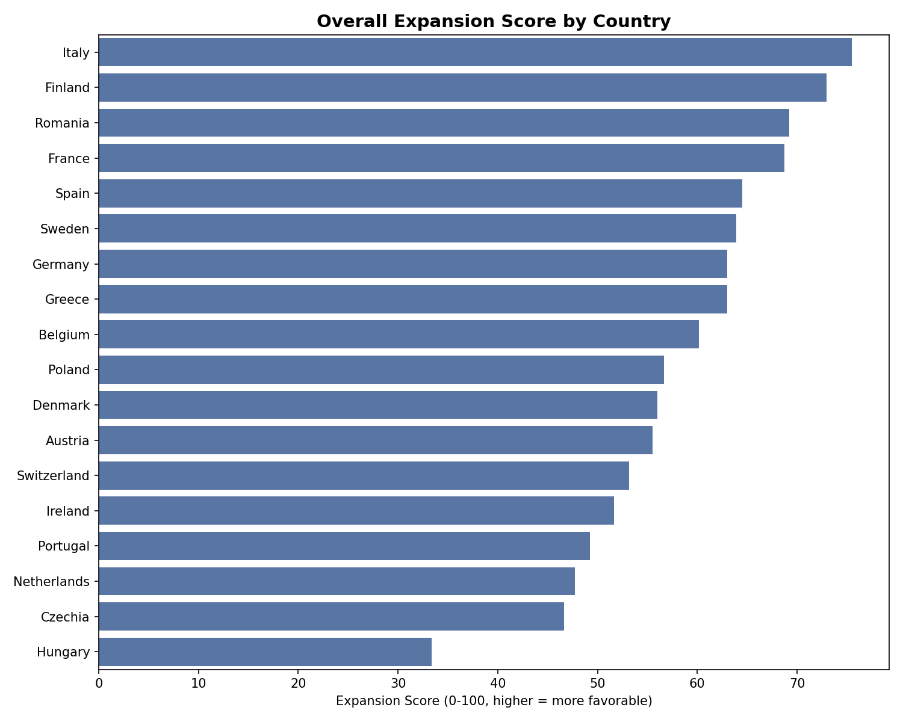

# 🇪🇺 EU Market Pulse

**Where should a remote-first company expand or hire in Europe, based on cost of living and inflation trends?**

🔗 **[Live Dashboard](https://eu-market-pulse-mcfmczf5fmzwtzuwwxjagm.streamlit.app)**



---

## Business Problem

Companies operating remote-first teams — particularly those based in the US, UK, Ireland, and Switzerland — increasingly consider expanding or hiring in Europe to access talent at a more favorable cost. But "cheap" and "stable" don't always go together: a country with low costs today may carry inflation or housing risks that erode that advantage over time.

This project answers that trade-off directly, scoring 19 European countries across three dimensions — **cost of living**, **inflation stability**, and **housing pressure** — and combining them into a single, interpretable **Expansion Score**.

## Tech Stack

- **Python** — data cleaning, EDA, KPI engineering (pandas, scikit-learn, matplotlib/seaborn, Plotly)
- **SQL** — analytical queries with window functions and CTEs (PostgreSQL)
- **Supabase** — cloud-hosted Postgres database
- **GitHub Actions** — automated weekly data pipeline (Eurostat API → cleaning → database upsert)
- **Streamlit** — public, interactive dashboard

## Pipeline Overview

```
Eurostat API (3 datasets)
        ↓
Python: fetch, clean, merge (pandas)
        ↓
Supabase (PostgreSQL): countries / market_indicators / country_kpis
        ↓
GitHub Actions: automated weekly refresh
        ↓
Streamlit: public dashboard
```

All three data sources (HICP inflation rate, price level indices, house price index) are fetched directly from Eurostat's public API — no manual downloads in the production pipeline. Because the underlying data refreshes weekly, country rankings shown in the live dashboard reflect the latest available figures rather than a fixed snapshot.

## What the Dashboard Reveals

Rather than listing a fixed ranking here — which would go stale as the pipeline refreshes weekly with new Eurostat data — this section describes the kind of insight the scoring is designed to surface. The live dashboard always reflects the current state:

- **A ranked Expansion Score** for all 19 countries, combining cost of living, inflation stability, and housing pressure into one comparable number.
- **Trade-off patterns** — for example, whether the cheapest countries in a given period are also the least stable, or whether any country combines both low cost and strong stability.
- **Housing risk flags** — countries where current affordability may not hold, based on the trajectory of house prices relative to the overall cost level.

Explore the [live dashboard](https://eu-market-pulse-mcfmczf5fmzwtzuwwxjagm.streamlit.app) for the current ranking, regional filters, and country-by-country comparison.

## Methodology Highlight: Forecasting

A linear trend model was tested to forecast future inflation, but was deliberately excluded from the final analysis after validation showed the short post-2022 recovery period does not provide a statistically reliable signal (see `notebooks/05_forecasting.ipynb` for the full exploration, including the three approaches tested and why each was rejected). The project's core business question remains fully answered by the historical KPI scoring and SQL analysis, which don't depend on forward projection.

## Project Structure

```
eu-market-pulse/
├── app/                  → Streamlit dashboard
├── data/
│   ├── raw/              → original Eurostat downloads
│   └── processed/        → cleaned, analysis-ready CSVs
├── images/               → exported charts
├── notebooks/            → step-by-step analysis (cleaning, EDA, Supabase prep, forecasting)
├── sql/                  → schema and analytical queries
├── src/                  → production pipeline script (Eurostat → Supabase)
└── .github/workflows/    → GitHub Actions automation
```

## Data Sources & Limitations

Data is sourced from [Eurostat](https://ec.europa.eu/eurostat)'s public API:
- `tec00118` — HICP Inflation Rate
- `tec00120` — Price Level Indices
- `tipsho10` — House Price Index

**Known limitations**, documented in full in the dashboard's methodology section:
- The United Kingdom is excluded from the Cost of Living and Overall Expansion scores, as Eurostat's price level data for the UK stops in 2019.
- Switzerland and the United Kingdom are excluded from the House Price Index, which Eurostat does not cover for these two countries.

## AI Development Partner

This project was developed with Claude (Anthropic) as an AI pair-programming and analytical partner — used for code review, debugging (including resolving local network/firewall issues affecting the Streamlit development environment), and structured decision-making throughout the pipeline (e.g. dataset selection, KPI design, and the decision to exclude an unreliable forecasting model). All data analysis, business interpretation, and final decisions are my own.

---

**Gabriel Souza** — [LinkedIn](https://linkedin.com/in/o-teu-perfil) · [GitHub](https://github.com/gabriel-souza-data)
